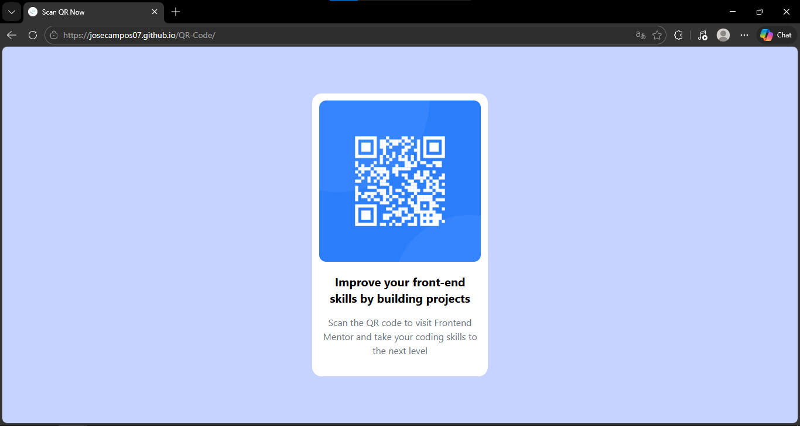

# 🧩 Proyecto: Componente QR Code

Este proyecto consiste en el desarrollo de un **componente de Código QR** utilizando **Astro** y **Tailwind CSS**.  
El objetivo es aplicar los conocimientos sobre **componentes**, **maquetación**, **estilos responsivos** y **utilidades CSS** para construir un diseño limpio, moderno y adaptable a diferentes dispositivos.

---

## 📖 Descripción general

### 🧩 Vista previa del proyecto

---

### 🔗 Enlaces del proyecto

- **Repositorio en GitHub:** [Agrega aquí la URL de tu repositorio](https://github.com/JoseCampos07/QR-Code)
- **Sitio desplegado (opcional):** [Agrega aquí la URL del proyecto desplegado, si usaste Vercel o Netlify](https://josecampos07.github.io/QR-Code)

---

## 🧠 Proceso de desarrollo

### 🛠️ Tecnologías utilizadas

- [Astro](https://astro.build)
- [Tailwind CSS](https://tailwindcss.com/)
- HTML5 semántico
- Diseño responsivo (Mobile-first)
- Componentes reutilizables

---

### 💡 Lo que aprendí

Durante el desarrollo de este proyecto, he aprendido sobre la manera en que los componentes conviven dentro del proyecto de Astro, de manera que, en conjunto, formen la página web. Además, he repasado mucho sobre el uso de clases de Tailwind para dar estilo de manera más eficiente al sitio.

---

### 🚀 Áreas de mejora

- Mejorar el manejo del responsive en pantallas pequeñas.
- Explorar la lista de clases de Tailwind y sus usos.
- Optimizar el uso de componentes para reducir la cantidad de código por archivo.

---

### 📚 Recursos útiles

Incluye los enlaces, documentación o tutoriales que te ayudaron a completar este proyecto.

**Ejemplo:**

- [Documentación de Astro](https://docs.astro.build)
- [Lista de clases de Tailwind CSS](https://tailwind.build/classes)

---

### 👩‍💻 Autor

- **Nombre completo:** José Angel Campos Mireles
- **Carrera:** 23151200
- **Grupo:** Programación Web TC1
- **Correo institucional:** 23151200@aguascalientes.tecnm.mx

---

### ✨ Reflexión final

El desarrollo de este proyecto ha resultado en una experiencia interesante y desafiante a la vez, considerando que, previo a este proyecto, tenía poca experiencia desarrollando con Astro y Tailwind CSS, por lo que investigar sobre cómo funciona el código de Astro, además de varias clases de Tailwind se volvió algo recurrente.  
A pesar de esos desafíos, definitivamente disfruté el acomodar elementos aún usando HTML por componentes de manera que al final, convergieran en una página web completa. Por lo que, gracias a este proyecto, he adquirido más experiencia de desarrollo con Astro y Tailwind para futuros proyectos y experiencias :D
